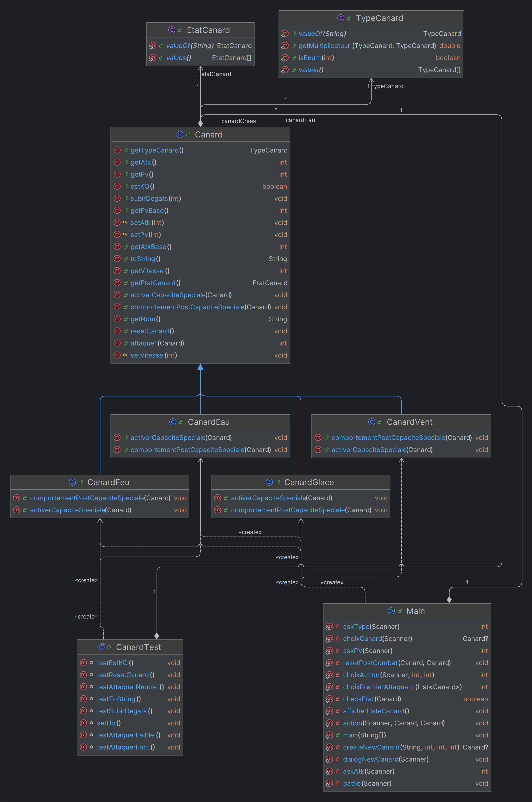

# CanardFighterSimulator

## 1. Quelles classes pourraient être abstraites ?

La classe de base `Canard` pourrait être une classe abstraite. Car un Canard dans le contexte du jeu ne peut pas exister.
Il faut que le canard soit d'un certain type (CanardEau, CanardFeu ...)

## 2. Quels comportements communs pourraient être définis dans une interface ?

La gestion des capacités spéciales pourrait être défini dans une interface.

## 3. Comment représenter un changement de statut (par exemple, brûlé ou paralysé) dans la modélisation ?

On peut créer une nouvelle variable "état" pour désigner l'état du canard (EtatCanard par ex. qui sera une enum)

## 4. Quels seraient les avantages d’utiliser une classe ou une interface supplémentaire pour gérer les capacités spéciales ?

L'avantage serait de déplacer la gestion des capacités spéciales (PE, modification d'attribut, gestion des capacités "temporaires") hors de la classe Canard 
pour respecter le principe SOLID.

## 5. Quels défis sont associés à l’extensibilité de votre modèle pour ajouter de nouveaux types de canards ou de nouvelles capacités ?

La matrice des multiplicateurs va grandir et donc l'initialisation prendra plus de temps (initialisation de la matrice = O(n²))
Pour ajouter des nouvelles capacités (dans le sens où un canard à plus d'1 capacité), 
il faut recréer une méthode abstraite pour activer/gérer la capacité spéciale pour chaque capacité spéciale à rajouter
(Même si on veut rajouter une capacité à un seul type).

## Diagramme UML
